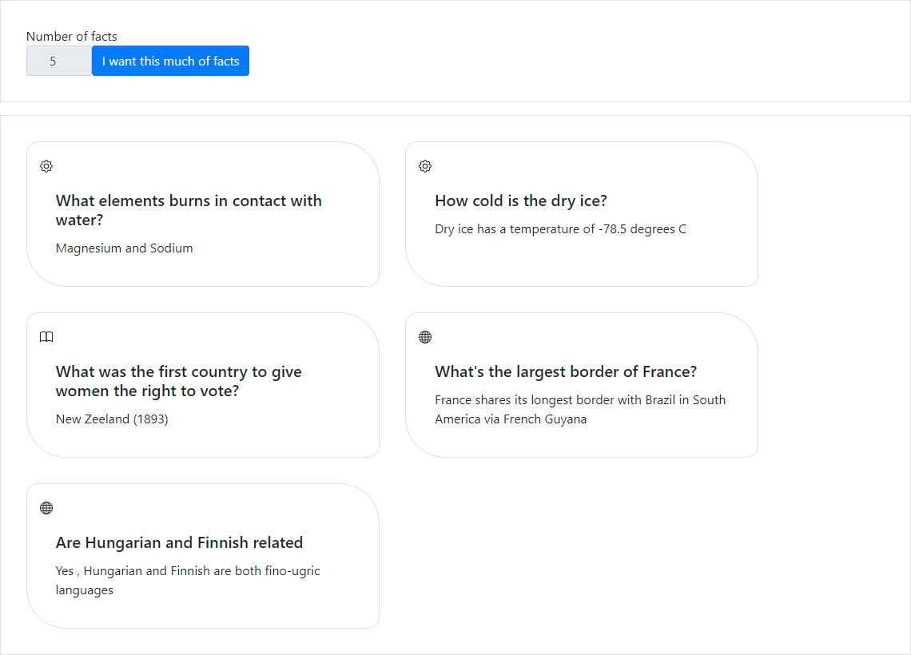

# Random fact generator website

Frontend :
* Bootstrap
* JQuerry

## Description

It generates several random facts , the number is controled from an numberic-spinner field , also its main title change to a word ,in a random language , that means "knowledge

When you decided how many facts you want , you will a list of random facts

## TODO
- [X] Add more facts
- [ ] Add even more facts
- [X] A Lot more refactoring
- [ ] Add a database
