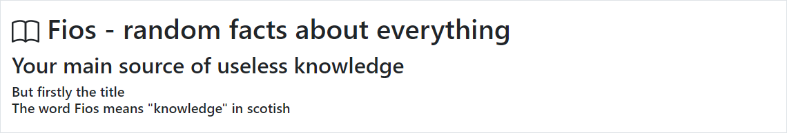
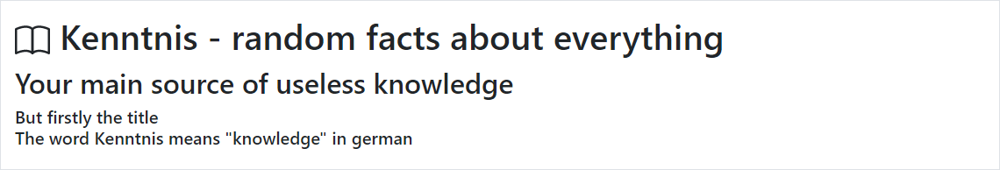

# Random fact generator website

Frontend :
	CSS framework : Bootstrap
	JS framework : JQuerry
Backend :

## Description

It generates several random facts , the number is controled from an numberic-spinner field.

It's main title change to a word ,in a random language , that means "knowledge".

When you decided how many facts you want , you will a list of random facts

## TODO
- [X] Add more facts
- [ ] Add even more facts
- [ ] A Lot more refactoring